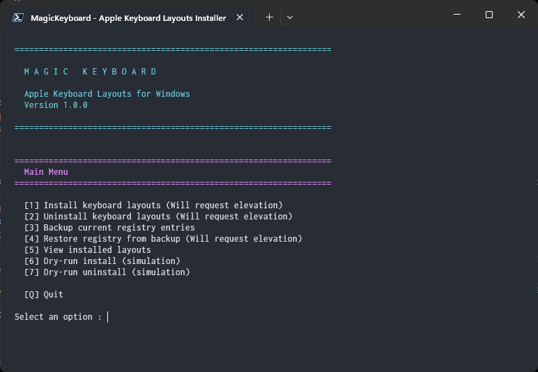

# magickeyboard

This is an alternative/mirror repository for the **Apple Magic Keyboard** 1 (removable batteries, rounded top), 2 (slim, embedded battery) and 3 (slim, rounded corners and embedded battery) **drivers**, plus all the Apple **keyboard layouts** currently available. Use your magic keyboard on any bluetooth enabled Windows machine.

[](https://www.youtube.com/watch?v=dQw4w9WgXcQ)
[](#)
[](#)
[](#)
[](#)
[](https://codeload.github.com/supermarsx/magickeyboard/zip/refs/heads/main)
[](#)


[**[Download this repository]**](https://codeload.github.com/supermarsx/magickeyboard/zip/refs/heads/main)

[**[Go to 'Quick Start' >>]**](#quick-start)


## Table of Contents

- [**Quick Start**](#quick-start)
  - [Driver only](#driver-only)
  - [Driver and layouts](#driver-and-layouts)
  - [Layouts only](#layouts-only)
  - [Other methods/options](#other-methodsoptions)
- [**Why did i make this?**](#why-did-i-make-this)
- [**File table**](#file-table)
- [**Installation instructions**](#installation-instructions)
  - [Automatically install driver](#automatically-install-driver)
  - [Manually install driver](#manually-install-driver)
  - [Automatically install layouts](#automatically-install-layouts)
  - [Manually install layouts](#manually-install-layouts)
  - [Uninstall layouts](#uninstall-layouts)
- [**Experimental Installation Methods**](#experimental-installation-methods)
  - [Scoop](#scoop)
  - [Winget](#winget)
- [**Layout topics**](#layout-topics)
  - [Layout languages](#layout-languages)
  - [Translate layout names](#translate-layout-names)
- [**Questions and problem resolution**](#questions-and-problem-resolution)
  - [Layouts don't get installed when running MagicKeyboard](#layouts-dont-get-installed-when-running-magickeyboard)
  - [Layout doesn't show up in keyboard layouts](#layout-doesnt-show-up-in-keyboard-layouts)
  - [I'm unable to bind, remap or reregister certain keys using x method](#im-unable-to-bind-remap-or-reregister-certain-keys-using-x-method)
  - [Are these files legit?](#are-these-files-legit)
  - [Screwed up badly?](#screwed-up-badly)
- [**Support, warranty, guarantees**](#support-warranty-guarantees)


## Quick Start

Recommended installation methods are [**Driver only**](#driver-only) or [**Driver and layouts**](#driver-and-layouts).


### Driver only

**Note:** You'll need administrator privileges.

To **install only the driver** follow these steps:

1. **Download** one of the installers for your keyboard version/model:
   - **Magic Keyboard 1**: [magickeyboard1_AppleKeyboardInstaller64.exe](https://github.com/supermarsx/magickeyboard/blob/main/magickeyboard1_AppleKeyboardInstaller64.exe?raw=true); 
   - **Magic Keyboard 2 and 3**: [magickeyboard2_AppleKeyboardInstaller64.exe](https://github.com/supermarsx/magickeyboard/blob/main/magickeyboard2_AppleKeyboardInstaller64.exe?raw=true).
2. **Execute** your chosen installer.

Your keyboard should be working as expected.


### Driver and layouts

**Note:** You'll need administrator privileges.

To **install both driver and layouts** follow these steps:

1. [**Download** drivers and layouts](https://codeload.github.com/supermarsx/magickeyboard/zip/refs/heads/main);
2. **Execute** the appropriate installer for your keyboard version/model:
   - `magickeyboard1_AppleKeyboardInstaller64.exe` for Magic Keyboard 1;
   - `magickeyboard2_AppleKeyboardInstaller64.exe` for Magic Keyboard 2 and 3.
3. **Navigate** to `All Keyboard Layouts` folder and run `MagicKeyboard.bat`.

Your keyboard and respective layouts should be working.


### Layouts only

**Note:** You'll need administrator privileges.

To **install keyboard layouts** follow these steps:

1. [**Download** all keyboard layouts folder](https://github.com/supermarsx/magickeyboard/releases/latest/download/All.Keyboard.Layouts.1.0.3.40.zip);
2. **Run** `MagicKeyboard.bat`.

Your keyboard layouts should be working as intended. 


### Other methods/options

To **install a single keyboard layout**, **use unpacked driver files** or **other different methods, options or combinations** you should refer to the [Table of Contents](#table-of-contents) to find your preferred method and alternative actions.

If can find more **downloadables** in the [**latest release page**](https://github.com/supermarsx/magickeyboard/releases/latest).

**Note:** Don't change files, installers, etc. specially if you don't know what you're doing, check the "[Screwed up badly?](#screwed-up-badly)" topic for more information. For most use cases just use the installers and you'll be fine. Major changes are needed only in specific use case scenarios.


## Why did I make this?

These packages are not readily available to end users and sometimes you'll not be able to find anywhere without downloading **bootcamp** from MacOS or `brigadier` for example. 

These packages **fix issues** such as not being able to **use delete key** (fn + backspace) on the keyboard or not **detecting the device properly**. 

Usually changes are **ready and functional** right after install but you may need to restart in some scenarios. 

Also **removes the need to fully install/download bootcamp** if you're not actually using an apple machine ...and it's free, no need for paid apps if you just need the damn thing working.

I needed an easy way to use Apples keyboard without getting all the bloat along with it and without any third party software and so this was born. 


## File table

**Drivers**

| Device                     | Filename                                                                                                                                                   |
| -------------------------- | ---------------------------------------------------------------------------------------------------------------------------------------------------------- |
| **Magic Keyboard 1**       | [magickeyboard1_AppleKeyboardInstaller64.exe](https://github.com/supermarsx/magickeyboard/blob/main/magickeyboard1_AppleKeyboardInstaller64.exe?raw=true)  |
| **Magic Keyboard 2 and 3** | [magickeyboard2_AppleKeyboardInstaller64.exe](https://github.com/supermarsx/magickeyboard/blob/main/magickeyboard2_AppleKeyboardInstaller64.exe?raw=true) |

**Layouts**

| Languages | Filename                                                                                                                               |
| --------- | -------------------------------------------------------------------------------------------------------------------------------------- |
| All       | [All.Keyboard.Layouts.1.0.3.40.zip](https://github.com/supermarsx/magickeyboard/releases/latest/download/All.Keyboard.Layouts.1.0.3.40.zip) |

**Specific layout files, inside `All Keyboard Layouts` folder**

| Filename                         | Description                                                                                                                                                                                                                |
| -------------------------------- | -------------------------------------------------------------------------------------------------------------------------------------------------------------------------------------------------------------------------- |
| `MagicKeyboard.ps1`   | **Unified installer/uninstaller** with TUI and CLI support. [[Go to file]](https://github.com/supermarsx/magickeyboard/blob/main/All%20Keyboard%20Layouts%20(1.0.3.40)/MagicKeyboard.ps1)     |
| `MagicKeyboard.bat` | **Launcher** for MagicKeyboard.ps1 (double-click to run). [[Go to file]](https://github.com/supermarsx/magickeyboard/blob/main/All%20Keyboard%20Layouts%20(1.0.3.40)/MagicKeyboard.bat) |
| `install_filelist.txt`           | **List** of keyboard layout DLL  files to install or uninstall. [[Go to file]](https://github.com/supermarsx/magickeyboard/blob/main/All%20Keyboard%20Layouts%20(1.0.3.40)/install_filelist.txt)                             |
| `*.dll`                          | Keyboard layout **DLL file** from Apple, list here: [Layout languages](#layout-languages).                                                                                                                                 |

## Installation instructions

### Automatically install driver

1. **Get** your corresponding **keyboard version installer**;

2. **Run** it, you'll need **administrator privileges**.


### Manually install driver

**Note:** Unless you have a **specific reason** for why you need individual files you should opt for automatic installation.

If you still need to **manually install** the driver for some special reason you can:

1. **Extract** files from the corresponding **keyboard version installer** (with 7-zip for example);
2. Do **one** of three things:
   1. **Execute** `DPInst.exe` directly;
   2. **Update** the device driver through the device manager and target the extracted folder;
   3. Whatever you want.


### Automatically install layouts

To **automatically install** all keyboard layouts you'll need:

1. A **copy** of `All Keyboard Layouts` folder;
2. **Run** `MagicKeyboard.bat` (double-click) or use the command line:

   - Interactive TUI (will show menu and auto-elevate):

     ```bat
     MagicKeyboard.bat
     ```

     

   - Command line install (will auto-elevate):

     ```powershell
     .\MagicKeyboard.ps1 -Action Install
     ```

   - Silent / unattended install:

     ```powershell
     .\MagicKeyboard.ps1 -Action Install -Quiet
     ```

   - Dry-run to preview changes:

     ```powershell
     .\MagicKeyboard.ps1 -Action Install -DryRun
     ```

Your keyboard layouts will be ready to use.

## Continuous Integration & maintenance

- This repository includes a GitHub Actions workflow at `.github/workflows/ci.yml` which runs lightweight lint/format checks and tests, validates the file list on Windows runners, and packages the layout folder as a ZIP artifact.
- Maintenance scripts are available in the `scripts/` directory for generating checksums, packaging releases, and running tests. There are both POSIX (bash) and Windows (batch/PowerShell) helpers to support running checks and packaging on CI or developer machines. Windows-specific scripts include `scripts\check-lint.bat`, `scripts\check-format.bat`, `scripts\compute_checksums.bat`, `scripts\run-tests.bat`, and `scripts\package_layouts.ps1`.

**Developer & testing**

- Run the complete test suite locally (POSIX host with PowerShell available):

```bash
chmod +x scripts/run-tests.sh
./scripts/run-tests.sh
```

- The test runner executes layout file/checksum validation, translation coverage, matrix checks and unit tests (POSIX shell tests and PowerShell Pester tests). If Pester is not present it will attempt to install it for the current user.

- To run only the POSIX tests:

```bash
./tests/posix/test_get_system_locale.sh
```

- To run PowerShell Pester tests manually (requires `pwsh`):

```powershell
pwsh -NoProfile -ExecutionPolicy Bypass -Command "Import-Module Pester -MinimumVersion 5.0; Invoke-Pester -Path './tests/powershell/pester' -EnableExit"
```

If you'd like, I can add or improve the CI workflow to run the same tests across Linux/macOS/Windows runners.

Installer UX and tests

- Installer and uninstaller show friendly step-by-step messages and a completion summary. You can use `/DRYRUN` to simulate an install/uninstall and review messages without making changes.
- Extensive tests added — the CI runs lint, format, POSIX and Windows tests and translation coverage checks. See `.github/workflows/ci.yml`.

### Locale-aware layout names

The layout installer supports translated `Layout Text` registry values. It detects the system UI locale and sets the translated layout name from `All Keyboard Layouts (1.0.3.40)/translations.json`. The installer falls back to English where translations are missing. See the `All Keyboard Layouts` README for more details.

To get a translated layout name programmatically:

```powershell
.\MagicKeyboard.ps1 -Action GetTranslation -Key 'BelgiumA' -Locale 'fr-FR'
# Output: Belge (Apple)
```

Additional installer flags (PowerShell)

- `-Locale <locale>`: force a specific locale when resolving translated layout names (examples: `en-US`, `fr-FR`, `zh-TW`). When omitted the installer will use the system UI locale.
- `-Layouts <key1[,key2,...]>`: only install the specified layout keys from `layouts.json`. Accepts multiple values or a single comma-separated string. Useful to install a single layout or a small subset.

Example (dry-run, using PowerShell):

```powershell
pwsh -NoProfile -ExecutionPolicy Bypass -File "./MagicKeyboard.ps1" -Action Install -DryRun -Locale "fr-FR" -Layouts "BelgiumA,USA"
```

This will simulate installing only the `BelgiumA` and `USA` layouts and show the resolved translations in French.


### Manually install layouts

To **manually install** a keyboard layout using a DLL you'll need:

- **Keyboard** layout DLL file (ex.: `BritishA.dll`);
- **Registry** information found in `layouts.json` or by running `MagicKeyboard.ps1 -Action List -ShowDetails`.

Then you need to follow these steps:

1. **Copy** DLL file to `system32` folder;
2. **Add** the corresponding layout keys to the registry through `reg add` commands using an elevated command line (cmd) prompt.

Your layout will be ready for use.


### Uninstall layouts

To **uninstall all keyboard layouts** follow these steps:

1. **Navigate** to `All Keyboard Layouts`;
2. **Run** `MagicKeyboard.bat` and select **Uninstall** from the menu, or use command line:

   ```powershell
   .\MagicKeyboard.ps1 -Action Uninstall
   ```

All Apple keyboard layouts should be gone.


## Experimental Installation Methods

**Warning:** These methods are experimental and may not work as expected. Use at your own risk.

### Scoop

[Scoop](https://scoop.sh/) is a command-line installer for Windows.

To install using Scoop:

1. Add this repository as a bucket:
   ```
   scoop bucket add magickeyboard https://github.com/supermarsx/magickeyboard.git
   ```
2. Install the package:
   ```
   scoop install magickeyboard
   ```

The package will download the repository, extract it, and run the installation script.

To uninstall:
```
scoop uninstall magickeyboard
```

**Note:** If you prefer not to add the bucket, you can install manually using the manifest from the `bucket/` directory:

1. Download the manifest file:
   ```
   powershell -Command "Invoke-WebRequest -Uri 'https://raw.githubusercontent.com/supermarsx/magickeyboard/main/bucket/magickeyboard.json' -OutFile 'magickeyboard.json'"
   ```
2. Run: `scoop install magickeyboard.json`

### Winget

[WinGet](https://docs.microsoft.com/en-us/windows/package-manager/) is the Windows Package Manager.

**Note:** WinGet does not support adding custom git-based sources like Scoop. For custom sources, a REST API is required, which this repository does not provide. Use the local manifest method below.

To install using WinGet with a local manifest:

1. Download the manifest file:
   ```
   powershell -Command "Invoke-WebRequest -Uri 'https://raw.githubusercontent.com/supermarsx/magickeyboard/main/winget/magickeyboard.yaml' -OutFile 'magickeyboard.yaml'"
   ```
2. Run: `winget install --manifest magickeyboard.yaml`

The package will download the repository, extract it, and run the installation script.

To uninstall:
```
winget uninstall supermarsx.magickeyboard
```

**Note:** If the package were available in the WinGet Community Repository, you could use: `winget install supermarsx.magickeyboard`


## Layout topics

### Layout languages

All keyboard layouts currently available:

- Belgian (Belgian (Apple)) (`BelgiumA.dll`)
- British (British (Apple)) - (`BritishA.dll`)
- Dutch (Dutch (Apple)) - (`DutchA.dll`)
- Finnish (Finnish (Apple)) - (`FinnishA.dll`)
- French (French (Apple)) - (`FrenchA.dll`)
- German (German (Apple)) - (`GermanA.dll`)
- Italian (Italian (Apple)) - (`ItalianA.dll`)
- Norwegian (Norwegian (Apple)) - (`NorwayA.dll`)
- Polish (Polish (Apple)) - (`PolishA.dll`)
- Portuguese (Portuguese (Apple)) - (`PortuguA.dll`)
- Russian (Russian (Apple)) - (`RussianA.dll`)
- Spanish (Spanish (Apple)) - (`SpanishA.dll`)
- Swedish (Swedish (Apple)) - (`SwedishA.dll`)
- Swiss (Swiss (Apple)) - (`SwissA.dll`)
- International English (International English (Apple)) - (`IntlEngA.dll`)
- USA (USA (Apple)) - (`USA.dll`)
- Chinese Traditional (??) - (`ChinaTA.dll`)
- Chinese Simplified (Chinese Simplified (Apple)) - (`ChinaSA.dll`)
- Turkish (Turkish (Apple)) - (`TurkeyA.dll`)
- Turkish Q (Turkish Q (Apple)) - (`TurkeyQA.dll`)
- Czech (Czech (Apple)) - (`CzechA.dll`)
- Hungarian (Hungarian (Apple)) - (`HungaryA.dll`)

**Note:** List schema: `Layout name` (`Layout name shown in Settings`) (`Corresponding DLL file`)


### Translate layout names

**Note:** You can customize layout display names using the translations system.

To **translate layout names** do the following steps:

1. **Navigate** to `All Keyboard Layouts folder`;
2. **Edit** `translations.json` to add your locale translations;
3. **Run** `MagicKeyboard.ps1 -Action Install -Locale <your-locale>` to install with custom names.

Alternatively, use the `-TranslationsFile` parameter to specify a custom translations file.

When you install/reinstall layout names will use your translations.


## Questions and problem resolution

### Layouts don't get installed when running MagicKeyboard

**You could try:**

1. **Launch** PowerShell as an **administrator**;
2. **Navigate** to the layout folder using `cd` and the respective folder path;
3. **Execute** `.\MagicKeyboard.ps1 -Action Install` from the elevated prompt.

Note: MagicKeyboard.ps1 will automatically request elevation if needed.


### Layout doesn't show up in keyboard layouts

**You could try:**

- **Try to look for the english name** of the layout that's how the installation is set above like (**ex. "Belgian (Apple)"**);
- Use `MagicKeyboard.ps1 -Action List -ShowDetails` to see all layout information;
- **Use translations** via `translations.json` or `-Locale` parameter to customize layout names;
- **Reinstall your keyboard layout** using `MagicKeyboard.ps1 -Action Install`.


### I'm unable to bind, remap or reregister certain keys using x method

If you're trying to somehow **change certain key functions** from your keyboard, binding, rebinding, remapping, whatever and seem unable to, you might be running into the **drivers limitations** of the keyboard on Windows, that means **i don't have a solution**. As far as i've tried in the past i wasn't able to use PowerToys, AutoIt, C++, AutoHotKey, C#, etc to do it successfully. **Some keys don't appear to register** at all even if they work as originally intended, meaning to solve this you'll need to somehow **reverse engineer** and go through all the hoops of that kind of process to maybe find a solution that works. I can't help with this, sorry. 

**Reference**, [Issue #1](https://github.com/supermarsx/magickeyboard/issues/1).


### Are these files legit?

They're **officially signed files from Apple** that you can check through the properties of each file, both DLL and executables. The only things that are **not official** are the **keyboard layout installer scripts (MagicKeyboard.ps1/.bat)** as well as the **file list** and the **old layout archive** containing a custom mapped pt-pt layout using the microsoft keyboard mapping tool thing many years ago.


### Screwed up badly?

Screwed up, deleted `system32` or something?

No warranty, **you're on your own**.

Good luck.


## Support, warranty, guarantees

- **Support only through issues** if i feel like it **with limitations**:
  - These may be **accepted**:
    - Open-source and/or verifiable additions;
    - Issues with related functionality;
    - Important undocumented issues or caveats;
    - Other very high importance issues.
  - These will be **rejected**:
    - Screw up issues and/or help;
    - Custom developments;
    - Special requests.
- **No warranties**, explicit and/or implied;
- **No guarantees**, explicit and/or implied.
